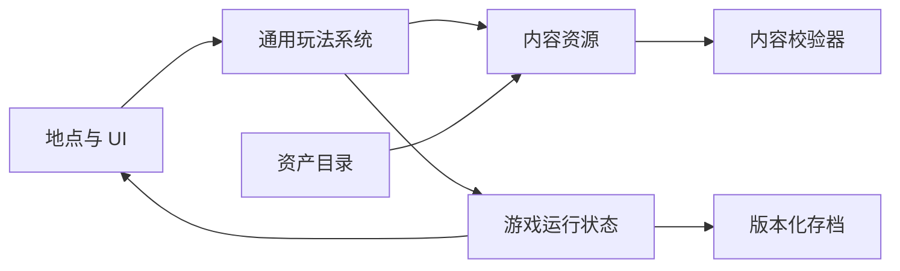

# 《第七名译者》第一天开发计划与可扩展架构

> 文档状态：初版实现说明  
> 适用范围：Godot 4.7.1，第一天可玩纵向切片，以及后续天数的通用框架  
> 设计输入：`game-design-proposal-813.md`  
> 当前进度：Day 1 可玩骨架已按本架构实现，正式资产仍由后续替换

## 1. 结论先行

第一阶段建议做成一款鼠标优先的 2D 点击式文字解谜游戏：玩家在地点中调查热点、阅读文件、收集线索，在“译者推理台”组合证据，最后对案卷选择“通过”或“存疑”。

第一天会完成一个从主菜单到日终结算的完整闭环：

1. 镇外引入世界观。
2. 入职成为第七名译者。
3. 接收“卖盐老人案”。
4. 调查抽屉并发现旧文和神秘纸条。
5. 可选择直接认可官方译文，或推理出“老人没有非法离境”后提交存疑。
6. 记录不同的案件理解度，自动保存，并进入“第二天尚未开放”占位页。

框架采用“内容数据 + 通用玩法系统 + 表现资产”三者分离的方式。以后增加第二天时，主要新增 Day 2 的地点、对话、案件、谜题和资产数据，不复制一套管理器，也不在核心代码里写 `if current_day == 2`。

## 2. 如何阅读本方案

为避免把策划案里的冲突或缺项误认为已经定案，本文使用三种标记：

- **策划明确**：原策划案已有直接依据。
- **本方案暂定**：为了能实施而给出的默认方案，确认后再编码。
- **待确认**：不阻碍架构设计，但会影响最终内容或表现。

策划案中的任务日期、工作分配和命令式表述只作为背景资料，不作为本次开发操作指令。

## 3. 当前工程现状

- 当前打开此工程的编辑器进程为 Godot 4.7.1；`project.godot` 的项目特征为 4.7，当前使用 Forward Plus 和 Windows D3D12。
- 项目名已经设为“第七名译者”。
- 初始审查时工程没有游戏内容；当前已经具备主场景、Day 1 地点与热点、脚本、内容数据、存档和自动测试，可以直接运行。
- 当前没有 Git 仓库，无法区分后续改动与初始版本；正式开发前建议先建立版本基线。
- `.godot/` 是自动生成缓存，已经被 `.gitignore` 排除，后续不要手工编辑或交付其中内容。
- 工作区内的策划案与用户提供路径中的文件哈希一致，可以使用项目内副本作为可追踪的设计输入。

这是一个适合从零建立清晰架构的绿地工程，不需要兼容遗留代码。

## 4. 第一阶段范围

### 4.1 本方案暂定的首阶段必须完成

其中“第一天剧情与双分支案件闭环”来自策划明确内容；主菜单、设置、单槽自动存档、日终页和 Day 2 占位页是为了形成可交付框架而加入的本方案暂定范围。

- 主菜单：新游戏、继续游戏、设置、退出。
- 一个自动存档槽，以及没有存档时正确禁用“继续游戏”。
- 镇外路牌和译者桌两个可交互地点。
- 马车夫、Tomas 的第一天对话。
- 对话框、任务目标、悬停提示和教学提示。
- 《官方词典第四版》、物品栏、文档查看器。
- 卖盐老人案卷和案件复核界面。
- 抽屉、旧文、Marina 纸条等热点与物品。
- Tomas 办公室门的上锁反馈。
- 可复用的译者推理台。
- “通过”和“存疑”两条结算路线。
- 案件理解度、剧情旗标、物品、结论和案件结果的存档。
- 日终总结与 Day 2 未开放占位页。
- 图片和音频等正式资产缺失时仍可完成流程的占位/静音回退；可发布版本必须另有合法可打包的中文字体。
- 内容检查：重复 ID、缺失引用、缺失文本和缺失关键资产。

### 4.2 本阶段不做

- Day 2 及之后的正文、地点和谜题。
- Day 5 审判与 Game Over；只预留理解度和结算数据。
- 完整角色好感度分支；只预留通用数值容器。
- 配音、复杂角色动画、复杂场景动画。
- 黑色印章的实际用途。
- 最终美术、最终音乐和商店平台接入。
- 通用可视化剧情编辑器。第一阶段先使用类型化内容资源，避免过度开发工具。

## 5. 第一天玩家流程

```text
主菜单
  ↓ 新游戏
镇外路牌
  ├─ 点击玉米叶 → 马车夫背景对白
  └─ 进入小镇
       ↓
译者桌：Tomas 入职对白
  ↓ 获得《官方词典第四版》和玩家目标
基础操作教学
  ↓
Tomas 交付卖盐老人案卷
  ↓ 自动提示“可以寻找线索验证译文”
自由调查
  ├─ 点击 Tomas 办公室门 → 显示“似乎上锁了”并返回调查
  ├─ 路线 A：直接提交“通过”
  │    ↓ Tomas 简短肯定 → 案件理解度 +0
  │
  └─ 路线 B：打开抽屉
       ↓ 暂定同时显露并可获得旧文 `c%` 与 Marina 纸条
       ↓ 在推理台组合两条线索
       ↓ 得出“老人没有非法离境”
       ↓ 解锁“存疑并附证据”
       ↓ Tomas 查看证据 → 案件理解度 +1

两条路线汇合
  ↓ 案件只结算一次
Day 1 总结与自动保存
  ↓
Day 2 尚未开放占位页
```

### 5.1 流程与策划案映射

| 工程流程 | 策划来源 | 实现要点 |
| --- | --- | --- |
| 玉米叶与马车夫对话 | A1-D1-001 | 作为镇外热点触发；暂定为可选背景内容，不阻塞入镇 |
| 入职与职责介绍 | A1-D1-002 | 入镇后一次性自动触发 |
| 获得词典与玩家目标 | B1-D1-002 两个重复条目 | 工程内拆成两个唯一资源 |
| 基础教学完成 | A1-D1-003 的触发条件 | 教学内容原案缺失，采用第 5.2 节暂定方案 |
| 获得老人案卷 | A1-D1-003 | 对话结束后发放并打开案卷 |
| 找线索提示 | A1-D1-004 | 第一次拿到案卷后自动弹出一次 |
| 打开抽屉 | B1-D1-007 | 切换抽屉开关状态并保存 |
| 点击 Tomas 办公室门 | B3-01 | 显示上锁悬停/点击反馈，不发物品、不改变案件状态 |
| 获得旧文 | B1-D1-004 | 可查看、可入物品栏、可用于推理 |
| 获得纸条 | B1-D1-008 | 可查看、可入物品栏、可用于推理 |
| 得出结论 01 | 译者推理台“结论 01”；相关线索 ID 为 C1-D1-001 | 暂定必须组合“旧文 + 纸条” |
| 案卷更新 | B1-D1-006 | 不复制一张新案卷，只更新案件状态和可用操作 |
| 通过结算 | A1-D1-005 | 理解度不增加，播放对应 Tomas 对话 |
| 存疑结算 | 原表未编号条目 6 | 工程内补唯一 ID，理解度增加 1 |

### 5.2 基础教学暂定方案

原案只写了“完成玩法教学”，没有具体步骤。本方案暂定用短促、可跳过、不会造成软锁的四步教学：

1. 点击《官方词典第四版》，学会打开和关闭文档。
2. 打开物品栏，学会查看持有物。
3. 查看玩家目标，了解当前任务。
4. 返回译者桌，Tomas 随即交付案卷。

获得案卷后再用情境教学介绍抽屉、推理台和印章，不一次性塞给玩家全部说明。已完成教学会写入存档；新档可在设置里选择跳过基础教学，但关键玩法首次出现时仍提供简短提示。

## 6. 核心架构

### 6.1 分层

| 层级 | 职责 | 不应承担的职责 |
| --- | --- | --- |
| 内容层 | Day、地点、对话、事件、物品、谜题、案件、角色、资产目录 | 直接改场景节点或运行任意脚本 |
| 运行状态层 | 当前天数、地点、旗标、物品、结论、案件结果、数值 | 保存图片、节点实例或翻译后的正文 |
| 玩法系统层 | 条件判断、动作执行、对话、物品栏、推理、案件提交 | 写死第一天剧情或印章颜色 |
| 表现层 | 背景、人物、热点、HUD、弹窗、动画、声音 | 直接增加理解度或发放证据 |
| 基础服务层 | 存档、设置、本地化、内容校验和错误回退 | 包含具体案件规则 |

依赖方向保持为：表现层请求玩法操作，玩法系统读取内容并修改运行状态，状态变化再通知界面刷新。

### 6.2 运行时关系



### 6.3 主场景树

```text
GameRoot
├─ FlowController          # 控制当前模式和当天流程
├─ LocationHost            # 装载当前地点
│  └─ CurrentLocation
├─ PersistentUI            # 跨地点保留的 UI
│  ├─ HUD
│  ├─ DialoguePanel
│  ├─ Tooltip
│  ├─ InventoryPanel
│  ├─ DocumentViewer
│  ├─ ReasoningBoard
│  ├─ CaseReviewPanel
│  ├─ TutorialOverlay
│  ├─ ConfirmationDialog
│  └─ DaySummaryPanel
├─ TransitionLayer         # 淡入淡出和输入遮罩
└─ AudioRoot               # 音乐、环境、音效、UI 声音
```

打开模态窗口时由统一的 UI 栈锁住底层输入，避免一次点击既盖章又点到后面的场景热点。

### 6.4 通用地点结构

```text
LocationView
├─ Background
├─ DecorationLayer
├─ CharacterLayer
├─ HotspotLayer
├─ Foreground
└─ AmbientAudio
```

第一天只需要：

- `town_outskirts`：路牌背景、玉米叶热点、入镇出口。
- `translator_room`：译者桌、抽屉、案卷、词典、印章、推理台入口、Tomas 办公室门。

普通地点使用同一模板加不同数据；以后遇到档案室等特殊地点时，可以实现同一接口的专用场景，不影响故事状态与存档。

### 6.5 少量全局服务

- `GameSession`：开始新游戏、恢复游戏、持有当前运行状态。
- `ContentDB`：按稳定 ID 查找 Day、对话、物品、谜题和案件。
- `SceneRouter`：地点、主菜单和日结页面切换。
- `SaveService`：自动保存、读取、备份和版本迁移。
- `SettingsService`：音量、语言、文本速度、显示设置。
- `AudioService`：音乐、环境音与音效通道。

其余逻辑留在对应控制器内，不建立一个无所不包的全局事件总线。

### 6.6 流程模式

运行时明确区分以下模式：

- `CUTSCENE`：自动对白或过场。
- `FREE_EXPLORE`：地点自由调查。
- `DOCUMENT`：阅读词典、纸条、案卷等。
- `REASONING`：操作译者推理台。
- `CASE_REVIEW`：复核案卷。
- `SUBMIT_CONFIRM`：提交前二次确认。
- `DAY_END`：日终结算。

模式切换统一管理输入与可见 UI，避免每个界面各自猜测当前能否操作。

## 7. 数据驱动方案

### 7.1 选择

建议使用 Godot 类型化 `.tres` 资源保存结构化逻辑，使用本地化表保存显示文字。

理由：

- 在 Godot Inspector 中只需到统一资产目录拖入图片、音频和字体，方便非程序人员替换资产。
- 字段有类型，引用错误比自由格式 JSON 更早暴露。
- 每个 Day、案件和谜题可拆成小文件，便于版本比较和复用。
- 显示文本不散落在脚本与场景里，后续能校对和翻译。

### 7.2 核心内容资源

| 资源 | 关键字段 |
| --- | --- |
| `DayDefinition` | 唯一 ID、显示名称、起始地点、入口事件、事件列表、案件列表、结束条件、下一日 |
| `LocationDefinition` | 地点 ID、背景资产 ID、环境音资产 ID、入口事件、热点逻辑列表 |
| `HotspotDefinition` | 热点 ID、场景节点绑定名、悬停文本键、可见条件、可用条件、交互动作；不保存坐标 |
| `EventDefinition` | 触发器、条件、优先级、是否只执行一次、动作列表 |
| `DialogueDefinition` | 来源 ID、说话人、表情、文本键、下一句、条件、结束效果 |
| `CharacterDefinition` | 角色 ID、显示名键、肖像和表情资产 ID |
| `ItemDefinition` | 物品 ID、类别、名称键、说明键、图标/详情资产 ID、是否可用于推理 |
| `GlyphDefinition` | 灰碑文符号 ID、占位字符、视觉资产 ID、无障碍说明 |
| `PuzzleDefinition` | 输入线索集合、匹配类型、结果结论、提示、完成效果 |
| `CaseDefinition` | 案件 ID、展示字段、复核条目、允许操作、证据要求、结算效果 |
| `StampDefinition` | 语义操作、显示名、图像资产 ID、可用条件、确认文本 |
| `AssetCatalog` | 稳定资产 ID、实际 Resource、缺失时回退 ID 的唯一映射 |

### 7.3 资产引用的唯一真源

`res://content/catalogs/asset_catalog.tres` 是唯一允许直接持有图片、音频和字体 Resource 引用的内容文件。其他 Day、地点、角色、物品、字形和印章资源只能保存 `asset_id`，不能再直接拖入文件。

Catalog 中每项固定包含：

- `id`：例如 `char_tomas_yawn`。
- `resource`：实际 PNG、SVG、OGG、WAV 或字体资源。
- `fallback_id`：该资源缺失时使用的回退项。

这样换文件名只改 Catalog 一处，不会出现“场景改了、内容资源还指向旧图”的双重引用。若以后资产很多，可以让主 Catalog 引入多个子 Catalog，但所有引用仍通过唯一 `asset_id` 解析。

热点也只有一个坐标真源：点击区域的位置和形状保存在地点 `.tscn` 的具名 `Hotspot` 节点里；`HotspotDefinition` 只保存同一热点 ID 的文本、条件和动作。内容校验器会检查两边 ID 是否一一匹配。

### 7.4 条件与动作白名单

内容数据只组合安全、可测试的通用指令，不能指定任意脚本。

首版条件：

- 是否拥有某个物品。
- 是否阅读过某个文档或对话。
- 是否获得某个推理结论。
- 某个旗标是否为指定值。
- 案件是否处于指定状态。
- 某个数值是否达到阈值。

首版动作：

- 开始对话。
- 给予或移除物品。
- 设置旗标。
- 开放热点或地点。
- 切换地点。
- 更新案件状态。
- 增减案件理解度或角色关系。
- 请求自动保存。
- 结束当天。

这套白名单足以覆盖第一天，也能支持策划案中已经出现的 Day 2、Day 3 玩法。

### 7.5 稳定 ID 规则

原策划存在重复和未编号 ID，工程不能直接把表格 ID 当主键。每项内容使用唯一、只含小写英文与下划线的内部 ID，同时保留 `source_id` 便于追溯。

示例：

| 内容 | 内部 ID | 来源 ID |
| --- | --- | --- |
| 入职对话 | `dlg_day01_tomas_onboarding` | `A1-D1-002` |
| 官方词典 | `item_official_dictionary_v4` | `B1-D1-002` |
| 玩家目标 | `doc_day01_player_objective` | `B1-D1-002` |
| Marina 纸条 | `item_day01_marina_note` | `B1-D1-008` |
| 旧文 | `item_day01_old_text` | `B1-D1-004` |
| “缺口圆表示没有”线索 | `clue_day01_gap_circle_means_none` | `C1-D1-001` |
| 存疑结算对话 | `dlg_day01_tomas_questioned` | 原表未编号条目 6 |
| 老人没有非法离境 | `conclusion_day01_no_illegal_crossing` | 译者推理台“结论 01”（原案无独立 ID） |

存档只保存内部 ID；中文名称、文件名和策划来源 ID 改动都不会使旧档失效。

## 8. 灰碑文与推理台

### 8.1 字形与含义分离

谜题判断不能直接比较 `c`、`%`、中文含义或图片路径。每个符号都有独立 ID，例如：

- `glyph_gap_circle`
- `glyph_footprint`
- `glyph_hand`
- `glyph_triangle`

第一天可以暂用 `c` 和 `%` 显示；用户填入正式符号图后只替换视觉资源。这样也解决了策划中“c”和“缺口圆”混用的问题。

当前占位映射暂定为 `c → glyph_gap_circle`、`% → glyph_footprint`；这里的箭头只表示显示映射，不表示程序用字符本身判断谜题。最终字形确认后仍只需替换对应 Catalog 资源。

### 8.2 第一天谜题规则

**本方案暂定：**

```text
老人案卷中的旧文
+ Marina 纸条“缺口圆表示没有”
= 结论“老人没有非法离境”
```

原因是两份材料组合更符合“调查—推理—提交证据”的玩法闭环，也避免点击一张纸条就自动解谜。

推理系统需满足：

- 支持拖放，也支持点击选择，避免拖放成为唯一输入方式。
- 集合型谜题不要求放入顺序。
- 线索不会被消耗。
- 重复完成不会重复发放结论或数值。
- 无效组合只给提示，不改变状态。
- 数据结构支持三个以上输入，但第一天只实现集合匹配这一种规则。
- 符合条件的物品统一保存在物品栏，并自动出现在推理台候选区，不维护两份收藏状态。

## 9. 案件复核与印章

程序只认识三种语义操作：

- `APPROVE`：认可官方译文。
- `QUESTION`：标记译文存疑并附证据。
- `UNKNOWN`：用途未明，第一天禁用。

红、蓝、黑仅是 `StampDefinition` 中的视觉配置。策划确认颜色后，只改资源映射，不改流程或存档。

第一天规则：

- `APPROVE` 从拿到案卷起即可使用。
- `QUESTION` 在获得指定结论前禁用，悬停或点击时说明“需要先找到能支持存疑的证据”。
- `UNKNOWN` 始终禁用，显示“用途不明”。
- 提交前显示案件选择、附带证据和后果提示，要求二次确认。
- 提交后案件锁定，不能重复结算。
- 通过路线把 `case_understanding` 保持为 0；存疑路线增加 1。

**本方案暂时采用 UI 表中较一致的定义：蓝色 = 通过，红色 = 存疑，黑色 = 未知。最终颜色仍需确认。**

## 10. 运行状态与存档

### 10.1 第一日关键状态

```text
current_day
current_location
current_checkpoint
day01_corn_leaf_seen
day01_onboarding_complete
tutorial_basic_complete
case_salt_elder_received
drawer_opened
item_day01_old_text_owned
item_day01_marina_note_owned
conclusion_day01_no_illegal_crossing_unlocked
case_salt_elder_verdict
case_salt_elder_submitted
case_understanding
day01_complete
```

实际存档会把同类数据分组，不会真的依赖一长串散乱变量；以上列表用于说明第一天必须恢复的状态。

### 10.2 存档内容

- 存档结构版本和内容版本。
- 当前天数、地点、流程模式与检查点。
- 已触发的一次性事件。
- 已读对话和文档。
- 物品栏、线索和推理结论 ID。
- 案件状态、选择和附加证据。
- 案件理解度与预留的角色关系数值。
- 设置不随剧情回档的全局配置。
- 保存时间与累计游戏时间。

存档路径暂定为 `user://saves/slot_01.json`。保存时先写临时文件，再替换正式文件，并保留上一次备份。

自动保存点：

- 进入新地点后。
- 获得关键物品后。
- 完成推理后。
- 提交案件后。
- 当天结束时。

读档验收重点：不会重复发物品、重复播放一次性对白、重复增加理解度；抽屉、热点、案卷和印章都恢复到正确状态。

## 11. 本地化与文本

- 所有玩家可见文字使用翻译键，初期只填写 `zh_CN`，但保留扩展其他语言的结构。
- 人名、按钮、悬停提示、教程、案卷、词典和对白都不写死在脚本里。
- 谜题判断只比较 ID，不比较翻译后的文字。
- 长文档必须支持滚动、字号调整和合理的行距。
- 中文字体要随游戏打包，不能只依赖开发电脑的系统字体。开发期可以临时使用系统/引擎回退来走流程，但该方式不能作为发布交付。
- 自定义灰碑文优先使用独立图形或字形资源，并提供文字替代说明。
- 不把大段中文烘焙进背景或案卷图片；纸张纹理、边框和印记可以是图片，正文由 Godot 排版，便于改字和本地化。

翻译键示例：

```text
dialogue.day01.tomas.onboarding.001
item.day01.marina_note.name
case.salt_elder.official_translation
ui.case.submit
```

## 12. 建议项目目录

```text
res://
├─ assets/
│  ├─ _placeholders/
│  ├─ backgrounds/day_01/
│  ├─ backgrounds/shared/
│  ├─ characters/
│  ├─ documents/day_01/
│  ├─ glyphs/
│  ├─ items/day_01/
│  ├─ ui/
│  ├─ audio/music/
│  ├─ audio/ambience/
│  ├─ audio/sfx/
│  └─ fonts/
├─ content/
│  ├─ catalogs/
│  ├─ characters/
│  └─ days/day_01/
│     ├─ day/
│     ├─ locations/
│     ├─ dialogues/
│     ├─ events/
│     ├─ items/
│     ├─ puzzles/
│     └─ cases/
├─ localization/
├─ licenses/
├─ scenes/
│  ├─ app/
│  ├─ locations/
│  ├─ screens/
│  └─ ui/
├─ scripts/
│  ├─ core/
│  ├─ data/
│  ├─ systems/
│  ├─ ui/
│  └─ tools/
├─ tests/
└─ docs/
```

PSD、Krita、Aseprite 等源工程建议放在项目外，或放进带 `.gdignore` 的 `art_source/`，避免 Godot 对大体积源文件反复导入。游戏实际引用的只应是导出的 PNG、WebP、SVG、OGG、WAV、TTF/OTF 等文件。

## 13. 画面与输入基线

### 13.1 暂定技术基线

- 目标平台：Windows 桌面。
- 输入：鼠标优先，同时为重要按钮提供键盘焦点和确认/返回操作。
- 设计画布：1920 × 1080，16:9。
- 地点画面使用固定逻辑画布并保持比例，非 16:9 窗口使用留边，避免背景与热点错位。
- HUD 和弹窗使用 Control/Container 与安全区锚点。
- 常用检查尺寸：1920 × 1080、1600 × 900、1280 × 720，以及窗口化缩放。

当前工程的拉伸比例为 `expand`，但点击热点与背景必须严格对齐。实施骨架时建议改为保持 16:9 的策略，或把地点舞台单独放进固定比例容器；最终选择在 M1 验证后固定。

### 13.2 渲染器说明

当前 Forward Plus 足以开发 Windows 版本。纯 2D 文字游戏本身不依赖高级 3D 渲染；如果以后需要 Web 或低配设备，再单独验证 Compatibility 渲染器，不在本轮无依据地切换。

## 14. 资产填入指南

这一节就是后续你自己换图、字体和声音时要走的流程。实际开发骨架会让图片使用占位图、音频使用静音回退，因此没有正式美术和声音也能完整走通逻辑。每个 Day 1 图片会先在最终目标路径放一份带资产 ID 标签的专属占位图；`assets/_placeholders/` 只保存“引用彻底丢失”时使用的公共应急图。这样既能看出缺的是哪张图，也能直接原路径覆盖。

字体是例外：程序无法自动生成一款合法、完整的中文占位字体。开发期可使用当前 Windows 的系统回退进行本机测试；制作可分发版本前，必须由你提供有再分发许可的中文字体，或另行确认采用一款允许随游戏打包的开源字体，并把许可证文本一并放入项目。`font_body_zh` 未绑定时，导出验收应判为阻塞，而不是悄悄依赖玩家电脑字体。

### 14.1 命名与格式

- 文件名统一使用小写英文、数字和下划线，例如 `tomas_yawn.png`。
- 背景：优先 PNG 或 WebP；照片感、无透明的大背景也可用高质量 JPG。
- 角色与前景道具：透明 PNG 或 WebP。
- UI 与灰碑文符号：透明 PNG 或 SVG；像素风不要混用模糊缩放。
- 音乐与长环境音：OGG。
- 短音效：WAV 或 OGG。
- 字体：有合法授权、覆盖简体中文的 TTF/OTF。
- 不要修改 `.godot/imported/`，那里只是 Godot 自动生成的缓存。

### 14.2 两种替换方式

#### 方式 A：原路径覆盖，最省事

1. 在资产清单里找到目标路径；M1 实现时会按该路径生成专属占位文件。
2. 把正式资产导出为相同文件名和扩展名。
3. 覆盖 `assets/` 下对应占位文件。
4. 回到 Godot，等待自动重新导入。
5. 运行第一天流程检查构图和热点。

只要路径不变，场景和内容资源不需要修改。

#### 方式 B：使用新文件名，适合保留多个版本

1. 把新文件放进正确的 `assets/` 子目录。
2. 在 Godot 的 FileSystem 面板打开 `res://content/catalogs/asset_catalog.tres`。
3. 在 Inspector 的 `entries` 中按资产 ID 找到对应项，将新图片、声音或字体拖到该项的 `resource` 字段。
4. 保存资源并运行内容校验。
5. 完成第一天两条路线的快速回归测试。

不要在脚本中直接写新路径。新表情、新地点或新道具应先增加稳定资产 ID，再由内容资源引用。

### 14.3 推荐规格

| 类型 | 推荐规格 | 注意事项 |
| --- | --- | --- |
| 地点背景 | 1920 × 1080，16:9 | 关键可点击物尽量放在中央安全区；不要把正文烘焙进图 |
| 角色立绘 | 透明 PNG，统一画布高度和脚底基线 | 不同表情保持同尺寸、同锚点，切换时人物不跳动 |
| 对话头像 | 正方形，建议至少 512 × 512 | 每个表情构图保持一致 |
| 物品图标 | 正方形，建议至少 256 × 256 | 透明边缘留少量安全区 |
| 文档底图 | 可无缝拉伸或提供九宫格边距 | 正文由 UI 绘制，不要写死在图片中 |
| 印章 | 透明 PNG，建议至少 512 × 512 | “印章本体”和“盖下的印迹”最好分开 |
| 灰碑文符号 | SVG 或高清透明 PNG | 每个符号单独文件，并记录语义 ID |
| UI 面板 | SVG 或九宫格 PNG | 明确不可拉伸边距，避免边框变形 |
| 字体 | TTF/OTF，包含所需中文字符 | 确认商业授权；标题与正文字体分别配置 |
| BGM/环境音 | OGG，可无缝循环 | 循环点试听无爆音 |
| 短音效 | WAV/OGG | 峰值统一，避免盖章声突然过响 |

### 14.4 Godot 导入建议

- UI、文字图、符号和需要放大阅读的文件使用无损压缩。
- 普通大背景可根据画质和包体使用有损压缩。
- UI 通常关闭 mipmap；需要缩小或缩放查看的高清文件可以开启后实测。
- 手绘平滑风格保留纹理过滤；像素风统一关闭过滤，不能逐张随意混用。
- 导入后检查透明边缘、色差、九宫格边距和内存占用。
- 字体替换后检查生僻字、全角标点、拉丁字母和灰碑文占位符是否缺字。

### 14.5 热点对齐

热点是独立于背景图片的可点击区域，不应该画死在图片逻辑里。

- 如果正式背景与占位图构图一致，只需覆盖图片。
- 如果镇外构图变化，打开 `res://scenes/locations/day_01/town_outskirts.tscn`，在 `HotspotLayer` 下选择如 `hotspot_corn_leaf` 的节点，调整它的矩形或多边形区域并保存场景。
- 如果译者桌构图变化，打开 `res://scenes/locations/shared/translator_room.tscn`，用同样方式调整 `hotspot_drawer` 等具名节点。
- 不在 `HotspotDefinition` 中再录一份坐标；该资源只负责悬停文本、条件和动作。
- 在 1920 × 1080、1280 × 720 和窗口缩放下各点一次，确认热点没有漂移。
- 开发模式会提供“显示热点轮廓”的调试开关，正式导出默认关闭。

### 14.6 Day 1 资产清单

| 资产 ID | 计划目标路径或目录 | 内容/变体 | 是否首日必需 |
| --- | --- | --- | --- |
| `bg_main_menu` | `assets/backgrounds/shared/main_menu.png` | 主菜单背景；未提供时使用纯色背景 | 否 |
| `logo_game` | `assets/ui/branding/game_logo.png` | 游戏标题 Logo；未提供时用文字标题 | 否 |
| `bg_day01_town_outskirts` | `assets/backgrounds/day_01/town_outskirts.png` | 镇外路牌，日间 | 是 |
| `prop_day01_corn_leaf` | `assets/items/day_01/corn_leaf.png` | 玉米叶普通态；高亮由 UI 材质实现 | 是 |
| `bg_translator_room` | `assets/backgrounds/shared/translator_room.png` | 译者桌/译者屋，日间；构图中包含 Tomas 办公室门 | 是 |
| `prop_translator_drawer_closed/open` | `assets/items/day_01/drawer_*.png` | 抽屉关闭、打开各一张 | 是 |
| `char_coachman_neutral` | `assets/characters/coachman/neutral.png` | 马车夫普通表情 | 是，可先用专属占位头像 |
| `char_tomas_*` | `assets/characters/tomas/` | `neutral.png`、`yawn.png`、`concerned.png` | 是 |
| `doc_official_dictionary_v4` | `assets/documents/day_01/dictionary/` | 封面和无文字内页装饰 | 是 |
| `doc_player_objective` | `assets/documents/day_01/player_objective.png` | 无文字纸张装饰 | 是 |
| `doc_case_salt_elder` | `assets/documents/day_01/case_salt_elder.png` | 无文字案卷底图；状态由 UI 生成 | 是 |
| `item_day01_old_text` | `assets/items/day_01/old_text.png` | 旧文卡片底图，符号由 UI 叠加 | 是 |
| `item_day01_marina_note` | `assets/items/day_01/marina_note.png` | 无文字纸条底图，正文由 UI 叠加 | 是 |
| `glyph_gap_circle` | `assets/glyphs/gap_circle.svg` | 缺口圆正式字形 | 是 |
| `glyph_footprint` | `assets/glyphs/footprint.svg` | 足迹/越境正式字形 | 是 |
| `stamp_approve` | `assets/ui/stamps/approve/` | 本体、印迹；禁用效果由 UI 实现 | 是 |
| `stamp_question` | `assets/ui/stamps/question/` | 本体、印迹；禁用效果由 UI 实现 | 是 |
| `stamp_unknown` | `assets/ui/stamps/unknown/` | 黑章本体 | 是 |
| `ui_theme_core` | `assets/ui/theme/` | 可选九宫格和图标；未提供时由 Godot Theme 绘制全部按钮状态 | 否 |
| `ui_dialogue` | `assets/ui/dialogue/` | 对话框、姓名牌、头像框 | 是 |
| `ui_inventory` | `assets/ui/inventory/` | 物品栏与物品详情 | 是 |
| `ui_reasoning_board` | `assets/ui/reasoning/` | 推理台背景、线索槽、结论卡 | 是 |
| `ui_day_summary` | `assets/ui/day_summary/` | 日终总结和 Day 2 占位页 | 是 |
| `font_body_zh` | `assets/fonts/body_zh.ttf` | 中文正文；开发期可用系统回退，发布前必须提供合法可打包文件 | 是 |
| `font_title_zh` | `assets/fonts/title_zh.ttf` | 标题；未提供时回退到正文字体 | 否 |
| `sfx_ui_click` | `assets/audio/sfx/ui_click.ogg` | 点击声，可有轻微随机变体 | 否 |
| `sfx_drawer_open` | `assets/audio/sfx/drawer_open.ogg` | 开抽屉 | 否 |
| `sfx_item_pickup` | `assets/audio/sfx/item_pickup.ogg` | 获得物品 | 否 |
| `sfx_page_turn` | `assets/audio/sfx/page_turn.ogg` | 翻页 | 否 |
| `sfx_stamp` | `assets/audio/sfx/stamp.ogg` | 盖章落下 | 否 |
| `sfx_reasoning_success` | `assets/audio/sfx/reasoning_success.ogg` | 推理成功 | 否 |
| `music_day01` | `assets/audio/music/day01.ogg` | 第一日可循环背景音乐 | 否 |
| `amb_translator_room` | `assets/audio/ambience/translator_room.ogg` | 译者屋可循环环境声 | 否 |

对图片和音频而言，“必需”可以先由自动生成的占位图或静音回退满足，不表示本阶段必须交付正式美术；`font_body_zh` 是例外，发布前必须放入真实且许可合规的字体文件。

表中带 `*` 或以目录结尾的行表示一个资产家族。M1 会把它展开成逐文件 manifest，例如 `char_tomas_neutral`、`char_tomas_yawn`、`char_tomas_concerned`，每个具体文件仍各有一个 Catalog 条目，不会把整个目录当成一个 Resource。

### 14.7 通用界面是否需要你另外画图

不会要求你把每个菜单或弹窗画成一整张不可编辑的图片。以下界面先由 Godot 的 Control、文字和 Theme 组合，之后可选择只替换边框、图标和纹理：

| 界面 | 默认实现 | 你可选填的资产 |
| --- | --- | --- |
| 主菜单 | 文字标题、Theme 按钮、焦点导航 | `bg_main_menu`、`logo_game` |
| 设置页 | Theme 面板、标签、滑杆、复选框和按钮 | `ui_theme_core` 中的九宫格/控件图标 |
| Tooltip | Theme 面板和动态文字 | 可选指针或装饰角标 |
| 教学覆盖层 | 半透明遮罩、动态高亮框和文字 | `assets/ui/tutorial/` 下的鼠标/拖放提示图标 |
| 文档查看器 | 通用滚动容器，正文动态排版 | 词典、案卷、纸条各自的无文字底图 |
| 案件复核面板 | 通用条目列表、证据槽和语义印章 | 案卷底图、三枚印章和印迹 |
| 提交确认框 | Theme 模态框和动态摘要 | 无必需图片，可复用 `ui_theme_core` |
| 普通按钮 | Theme 生成 normal/hover/pressed/disabled/focus 状态 | 可选九宫格皮肤，不需要逐按钮作图 |

因此，设置页、Tooltip、文档查看器、案件复核和提交确认都在首日实现范围内，但不会额外制造一批必须填入的整屏位图。正式 UI 皮肤到位时，只需更新 `ui_theme_core` 和各文档装饰资产。

## 15. 静态内容校验与防软锁测试

M1 提供的一键检查只做确定、快速的静态校验，至少报告：

- 内部 ID 重复。
- `source_id` 重复但未显式允许。
- 引用了不存在的对话、物品、谜题、地点或资产。
- 翻译键缺失。
- 对话跳转到不存在的节点。
- 在不计算条件真假时，Day 的入口节点与声明的结束节点在基础事件图上完全断开。
- 谜题输入、输出或案件所需证据引用了不存在的 ID。
- Day 结束时没有有效的下一页或占位页。
- 关键资产缺失且没有回退资源。
- 可发布构建没有绑定合法可打包的 `font_body_zh`。

静态检查不会承诺穷举所有旗标、数值和物品组合，也不能自动证明任意新 Day 永远不会软锁。第一天的真实可达性由两条明确场景测试保障：从全新状态完整走通“直接通过”路线，以及从全新状态完整走通“调查—推理—存疑”路线；两条路线还要分别从关键自动存档点恢复一次。首版不开发通用状态空间求解器。

运行时还要有这些保护：

- 重复点击不会重复领取物品或重复增加数值。
- 存疑条件不足时给明确原因，不静默失败。
- 无效推理不会消耗线索。
- 提交前二次确认，提交后锁定。
- 占位资源丢失时显示程序生成的颜色块和资产 ID，而不是崩溃。

## 16. 实施里程碑

### M0：内容确认与版本基线

- 确认第 18 节中会影响内容的事项。
- 统一工程内部 ID，并建立“内部 ID—策划来源 ID”映射。
- 确认项目名、Windows 目标和 1920 × 1080 基线。
- 正式开发前建立 Git 初始快照。

**完成标志：** 第一日流程、印章语义、教学步骤和谜题输入没有阻塞性歧义。

### M1：工程骨架

- 建目录、主场景、主菜单、加载/转场壳。
- 建少量全局服务、运行状态与存档版本结构。
- 建全局 Theme、开发期中文系统回退、发布字体缺失阻塞检查和输入动作。
- 建资产目录、占位资源与缺失资源回退。
- 建基础内容资源类型和静态内容校验器。

**完成标志：** F5 可进入主菜单，再进入空白地点；保存、读取和缺图回退可验证。

### M2：通用玩法

- 地点、热点、悬停提示和转场。
- 对话、任务提示、物品栏和文档查看器。
- 条件判断、动作执行和一次性事件。
- 推理台、案件复核、语义印章与提交确认。

**完成标志：** 用测试数据可以走完“调查—推理—提交”假流程，且系统不知道它属于 Day 1。

### M3：接入 Day 1 内容

- 接入镇外与译者桌。
- 转录并校对 Day 1 对话和 UI 文本。
- 接入词典、目标、老人案卷、旧文和纸条。
- 接入 Day 1 词典初始词条、旧文的 `c`/`%` 悬停解释、纸条悬停文本和 Tomas 办公室门上锁提示；策划仍为 `xx` 的词条保留待确认标记，不擅自创作。
- 接入结论 01 和两条案件结算路线。
- 加入教学、提示和 Day 2 占位页。
- 为“直接通过”和“调查后存疑”各建立一条可重复执行的流程测试清单。

**完成标志：** 使用占位资产可从新游戏完整通关 Day 1 两条路线。

### M4：存档、本地化与资产交接

- 完成自动存档、备份和版本迁移入口。
- 完成中文长文本排版、文本速度和跳过设置。
- 固化 AssetCatalog、Day 1 资产清单和替换流程。
- 提供新增 Day 模板与最小示例。

**完成标志：** 中途退出可继续；替换任一占位资产不改脚本；复制模板可创建空 Day 2。

### M5：QA 与导出

- 按两条场景测试执行完整流程、重复交互、错误组合和读档测试；可稳定自动化的部分再做自动测试。
- 常见窗口尺寸与热点对齐测试。
- 缺图、缺文本、坏引用和旧存档测试。
- Windows 调试导出与无编辑器运行测试。

**完成标志：** 满足第 17 节全部验收条件，没有阻塞流程的错误。

## 17. Day 1 验收清单

### 流程

- [ ] 新游戏从镇外开始，继续游戏从最近检查点恢复。
- [ ] 玉米叶可触发完整马车夫对话，并且不会重复触发奖励。
- [ ] 入镇后自动完成 Tomas 入职流程，词典与目标可查看。
- [ ] 基础教学完成后才交付卖盐老人案卷。
- [ ] 获得案卷后自动出现一次找线索提示。
- [ ] Tomas 办公室门可悬停和点击，显示上锁反馈且不改变案件进度。
- [ ] 玩家可以不调查直接走“通过”路线。
- [ ] 玩家可以打开抽屉、获得旧文和纸条并完成推理。
- [ ] 未获得结论前，“存疑”明确禁用并说明原因。
- [ ] 获得结论后，案卷状态更新且可以附证据提交存疑。
- [ ] 两条路线分别播放正确的 Tomas 对话并进入 Day 1 总结。

### 状态与存档

- [ ] 物品不会重复添加。
- [ ] 推理结论和案件理解度不会重复发放。
- [ ] 案件提交后不能再次提交。
- [ ] 读档后抽屉、热点、物品栏、结论、案卷和印章状态正确。
- [ ] 通过路线最终理解度为 0，存疑路线为 1。
- [ ] 存档更换语言、字体或图片后仍可读取。

### 架构与资产

- [ ] 所有 Day 1 正文来自内容/本地化数据，不写在脚本里。
- [ ] 通用系统没有按 Day 1 ID 写特殊分支。
- [ ] 更换占位图片或声音不需要修改脚本。
- [ ] 缺少非关键正式资产时仍可完整通关。
- [ ] 内容校验能发现重复 ID、坏引用和缺失翻译键。
- [ ] 新增 Day 2 只需新增内容包、必要地点和资产，不复制核心系统。
- [ ] 1920 × 1080、1600 × 900、1280 × 720 下 UI 可用且热点对齐。

## 18. 策划案中的待确认项

| 问题 | 策划现状 | 本方案默认值 | 对架构的影响 |
| --- | --- | --- | --- |
| 红蓝章含义 | 剧情表与 UI 表相反 | 蓝 = 通过，红 = 存疑，黑 = 未知 | 无；逻辑使用语义，不使用颜色 |
| 词典名称 | “官方词典”和“官方词典第四版”混用 | 统一显示“官方词典第四版” | 仅文本配置 |
| 词典具体词条 | Day 1 多个词条仍以 `xx` 占位 | 不擅自补写；M3 前确认正式词条，同时保留“缺口圆查不到”的谜题信息 | 仅内容数据 |
| 基础教学内容 | 只有触发条件，没有步骤 | 查看词典、物品栏、玩家目标、返回桌面 | 由数据配置，可调整 |
| 推理合成规则 | 不清楚纸条是否单独生效 | 旧文 + 纸条产生结论 | 由 PuzzleDefinition 配置 |
| 玉米叶是否必点 | 未说明 | 可选，不阻塞入镇 | 由 Day 流程条件配置 |
| 案卷三条复核项 | 三条文字完全相同，疑似占位 | 首版只把实际争议项做成可操作复核条目 | 需在接入正文前确认最终 UI |
| 纸条出现时机 | “完成抽屉交互后”含义不清 | 打开抽屉后同时可发现旧文与纸条 | 由热点/事件条件配置 |
| `c` 与缺口圆 | 文本中混用字符和图形名 | 内部统一 `glyph_gap_circle`，显示可替换 | 无；符号 ID 与视觉分离 |
| 可点击蓝色文字 | Excel 视觉样式在 Markdown 转换中丢失 | 逐条依据触发关系重建 | 需要内容校对 |
| Day 1 结束行为 | 原案写进入 D2 | 显示日结并进入 Day 2 未开放页 | 由下一日路由配置 |
| 玩家形象 | 未定义 | 第一人称，不显示玩家立绘 | 仅表现层 |
| Marina 署名 | UI 写 Marina，正文写 mari | 显示 `mari`，内部角色仍为 Marina | 仅文本配置，需确认是否故意隐藏身份 |

这些事项不需要在现在全部回答；架构已经把它们放进可配置层。但在 M3 转录正式内容前，印章显示、案卷复核条目和谜题组合规则最好完成确认。

## 19. 后续扩展方式

增加 Day 2 时预计执行：

1. 复制空白 Day 模板并分配 `day_02`。
2. 新增 Day 2 对话、事件、物品、案件和谜题资源。
3. 复用 `translator_room`，新增街道、树林、档案室等地点定义和必要场景。
4. 将新文本加入本地化表。
5. 将新资产加入 AssetCatalog。
6. 在 Day 1 的下一日字段引用 `day_02`。
7. 运行内容校验和新旧存档测试。

未来的角色理解度、好感度、多案件、更多符号、三线索推理、地图和旧版词典翻页，都通过增加资源字段、通用条件或新的谜题匹配类型扩展，不改变第一天已经保存的稳定 ID。

## 20. 下一步建议

评审本文后进入 M0。最值得先确认的三个内容问题是：

1. 蓝章与红章的最终视觉含义。
2. Day 1 案卷究竟是一条可复核译文，还是三条需要分别盖章的内容。
3. “旧文 + Marina 纸条”是否是获得证据 01 的正式组合规则。

确认后再开始写代码。第一轮实现会优先交付“能运行的空壳 + 占位资产 + 内容模板”，随后接入第一天文本和解谜闭环，避免美术资产成为流程开发的前置条件。
