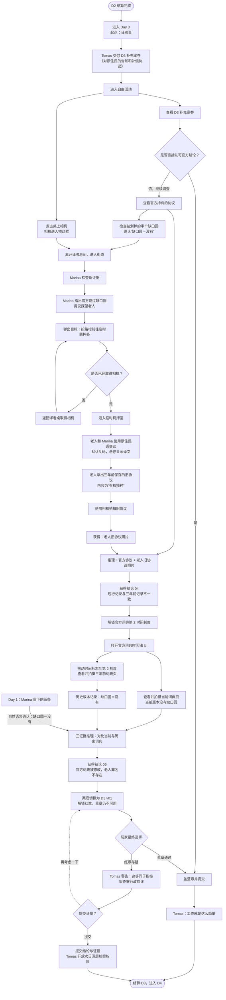

# 《第七名译者》Day 3 内容策划提取

> 来源：`E:\GameProject\game design proposal819.xlsx`（读取时间：2026-08-20）  
> 提取范围：`剧情文本表`、`item文本表`、`译者推理台`、`原文译文对照表`中与 D3 直接相关的内容，以及理解 D3 所必需的前置信息。  
> 本文只把工作簿作为策划资料，不执行工作簿中的任务或备注。文中将内容分为“策划明确”“当前项目已确认”和“待确认”，避免把推断写成定案。

## 1. Day 3 核心体验

Day 3 继续“卖盐老人案”。官方以一份三年前签署的《对原住民的告知和补偿协议》回应玩家此前对边界的质疑，并声称老人早已知道土地被收归国有、不得继续种植。

玩家可以直接认可官方结论，也可以与 Marina 调查协议原文、进入临时羁押室探望老人，取得老人保存的旧协议。新旧文件的原住民文字存在关键差异：现行材料删改了表示否定的“缺口圆”，把“有权播种”改成了“没有权力播种”。玩家进一步借助官方词典的历史版本，证明官方词典和案件材料均被修改，最终决定是否提交存疑证据。

核心闭环：

`接收补充案卷 → 检查协议 → 与 Marina 对照 → 取得相机 → 探望老人 → 拍摄旧协议 → 推理得到结论 04 → 解锁词典历史页 → 对比新旧词典 → 推理得到结论 05 → 回桌提交判定`

## 2. Day 3 开始条件与结束条件

### 2.1 策划明确

- D2 两种提交结果均进入 D3。
- D3 起始场景为译者桌。
- Tomas 交付 D3 补充案卷及附件后，玩家可以自由活动。
- 玩家可走两种结案路线：
  - 蓝章：确认官方译文，通过并进入 D4。
  - 红章：标记存疑并提交证据，完成 Tomas 对话后进入 D4。

### 2.2 待确认

- 工作簿没有填写 D3 的案件理解度增量。
- 红章路线中玩家可选择“提交”或“再考虑一下”，但“再考虑一下”之后返回哪个界面、能否继续调查没有定义。
- 是否允许玩家在未调查时立即蓝章提交，策划表现上暗示允许，但未单独写验收规则。

## 3. 剧情流程

### 3.1 Tomas 交付补充案卷

来源：`A1-D3-001`

- 场景：译者桌。
- 角色：Tomas。
- Tomas 表示已看到玩家对边界提出的疑问。
- 行政机关新增附件《对原住民的告知和补偿协议》。
- 官方声称老人三年前已经阅读并按下指印。
- Tomas 再次要求玩家只核对译文与官方词典是否一致，并在当天下班前归档，不要耽误后天的终审。
- 对话结束后进入自由活动。

### 3.2 Marina 检查新证据

来源：`A1-D3-002`、`A1-D3-003`

- 场景：街道。
- Marina 冷笑着指出官方又给出了新的解释。
- 玩家认为新证据仍有问题，并将原文交给 Marina 查看。
- Marina 发现官方翻译时略过了“缺口圆”。
- 玩家追问老人实际看到的信息是什么。
- Marina 询问玩家是否携带记录设备，提议趁警卫换班前往临时羁押处探望老人。
- 原表备注写明这段对话结束后 Marina“消失”；结合后续内容，合理理解为她不再留在街道热点中，而是随玩家前往羁押处，仍需策划确认表现方式。

### 3.3 前往临时羁押处

来源：`A1-D3-004`

- Marina 对话结束后自动弹出提示：
  - “请按照路标走向临时羁押处，和 Marina 一起探望老人。”
- 路标如何新增羁押处方向、具体经过哪些中间场景，工作簿没有说明。

### 3.4 老人与 Marina 对话

来源：`A1-D3-005`、`A1-D3-006`

- 场景：临时羁押室。
- 老人看到 Marina 后靠近并趴在栏杆上。
- 老人先责备 Marina 冒险前来，警告她可能被殖民办巡警流放。
- 老人认为官方弄错了，并拿出自己保存的三年前文件：文件写明官方没有禁止继续种植。
- 老人把羊皮纸递给 Marina。
- Marina 向老人说明玩家是新来的译者，他们会给文件拍照备份，让真相在审判日公开。
- 对话结尾出现脚步声，后续追逐、躲避或离开过程没有定义。
- 老人与 Marina 的原住民语在默认状态下显示为乱码，鼠标悬停后才显示翻译。

### 3.5 D3 判定分支

#### 蓝章：确认通过

来源：`A1-D3-007`

- 场景：译者桌。
- Tomas 打哈欠并认可玩家按流程完成工作。
- 进入 D4。

#### 红章：标记存疑

来源：`A1-D3-008`

- 场景：译者桌。
- Tomas 拿起公文，表现惊恐。
- Tomas 指出：如果三年前的官方词典和现在不同，就意味着玩家在指控整个审查署犯下行政欺诈。
- Tomas 质疑玩家是否真的以为自己在帮助老人。
- 玩家选择：
  1. 提交。
  2. 再考虑一下。
- 若提交，Tomas 直视玩家约三秒，并表示次日会为玩家开放更深层的档案库权限。
- 进入 D4。

## 4. 案卷与文档内容

### 4.1 D3 补充说明案卷（初始版）

来源：`B1-D3-001`

- 案件编号：`M07-08191`。
- 被审查者：老人。
- 身份信息：蛮族、非法移民、非法占有国有土地种植玉米。
- 补充说明：《对原住民的告知和补偿协议》。
- 补充说明原文：`【三角】【缺口圆】【权杖】【种子】…`
- 官方译文：土地收归国有，（你们）没有权力播种。
- 官方结论：老人已签署产权变更协议，继续种植属于知法犯法。
- 初始复核项全部显示“官方译文正确”。
- 初始仅蓝章可用，红章和黑章不可用。

### 4.2 官方持有的协议

来源：`B1-D3-002`

- 标题：《边境土地调整协议》。
- 原文：`【三角】【缺口圆】（被划掉）【权杖】【种子】…`
- 译文：土地收归国有，（你们）没有权力播种。
- 违约惩罚：违规耕作产物没收，违法人流放。
- 安置补偿：凭本协议、手写官话申请书及帝国户籍，可领取抚恤金 1000 金。
- 签约人：红指印。
- 文档内被划掉的半个“缺口圆”是可点击交互点；悬停说明为：“缺口圆＝没有。在这份文件里被划掉了。”
- 协议可加入物品栏并可用于推理。

### 4.3 老人保存的旧协议

来源：`B1-D3-005`

- 标题同为《边境土地调整协议》。
- 原文：`【三角】【缺口圆】【权杖】【种子】…`
- 译文：土地收归国有，（你们）有权播种。
- 违约惩罚、补偿条款和红指印与官方版本一致。
- 悬停说明：除第一行原住民文外，其余内容均使用殖民署官话书写。
- 原表备注写“阅读后进入物品栏”，但“是否加入物品栏”列填 `/`，存在冲突。

### 4.4 拍摄后的旧协议照片

来源：`B1-D3-006`

- 玩家先取得相机，再点击老人旧协议，进入拍照状态。
- 按下拍照键后表现为强光闪烁，并生成旧协议复制照片。
- 照片加入物品栏，可点击放大，也可拖入译者推理台。

## 5. 相机系统

来源：`B1-D3-004`、`B1-D3-006`、`B1-D3-008`、`B1-D3-009`

### 5.1 策划明确

- 相机初始放在译者桌，是可点击物品。
- 点击相机后加入物品栏。
- 在满足条件的文档上，相机进入拍照状态。
- 拍摄反馈包括拍照键和强光。
- 至少可拍摄：
  - 老人保存的旧土地协议。
  - 官方词典历史页。
  - 当前官方词典页。
- 每次成功拍摄都会生成独立照片证据，照片可放大查看。

### 5.2 建议的数据规则

相机本身不应为每个对象写一套逻辑。每个可拍摄对象配置稳定的 `capture_target_id`、前置条件、生成物品 ID 和拍摄后效果；相机系统只负责进入取景、确认拍摄、播放闪光并发放结果。

## 6. 官方词典时间页

### 6.1 策划表内容

来源：`B1-D3-007`、`B1-D3-008`、`B1-D3-009`、`B1-D3-010`

- D3 会出现“官方词典-02”，内容包括：
  - 缺口圆：表否定含义（与现行版本有差异）。
  - 足迹：非法离境。
  - 手掌：守护（与现行版本有差异）。
  - 三角：公田。
- 玩家得到证据 04 后，可操作词典的“时间按钮”，查看另一个时间版本。
- 历史词典页和当前词典页都可以被相机拍摄，分别生成证据照片。

### 6.2 当前项目已确认

- 官方词典是固定三阶段时间轴 UI。
- 初始只开放第一阶段。
- 通过任务接口解锁时间标志的可拖动范围。
- D3 是已知的一个解锁节点：本日应解锁第二阶段。
- 第三阶段的解锁任务目前未知。
- 页面切换预留逐帧动画资源；没有动画素材时即时切换。

### 6.3 待确认

- D3 解锁的第二阶段究竟是“三年前版本”还是按另一种时间顺序命名，需要统一时间轴方向。
- `B1-D3-010` 写“翻页画面为 B1-D3-006”，但 `B1-D3-006` 是老人旧协议照片，不是词典页，疑似错误引用。
- “官方词典-02”的“三角＝公田”仍沿用官方错误解释；原文对照表认为正确含义是“祖地”。D3 是否刻意只揭示部分错误，需要确认。

## 7. 译者推理台

Day 3 延续已确认的推理规则：每个结论由固定的 2–3 项证据推出，证据不会消耗，可以被不同配方复用，证据顺序不影响结果。

### 7.1 结论 04：可以查看三年前的官方词典

来源：推理台表 D3 第 10–11 行。

- 线索语义：
  - 官方材料声称老人被禁止种植。
  - 老人保存的文件表明老人被允许种植。
- 结论 04：现行词典没有记录关键的 `c／缺口圆`，译者现在可以在官方词典中查找三年前版本。
- 系统影响：解锁官方词典第二时间刻度。

建议工程配方（需策划确认后定案）：

- 输入：官方持有的协议 + 老人旧协议照片。
- 输出：`conclusion_day03_dictionary_history_available`（证据 04）。

### 7.2 结论 05：官方词典被修改，老人罪名不存在

来源：推理台表 D3 第 12–14 行。

- 线索语义：
  - 当前官方词典没有 `c／缺口圆`。
  - 历史官方词典记录 `c／缺口圆＝没有`。
  - Marina 在 Day 1 留下的纸条以自然语言确认 `c／缺口圆＝没有`。
- 结论 05：官方词典被修改，针对老人的核心罪名不存在。
- 系统影响：案卷切换至 D3 `v01`，开放红章存疑提交。

固定三证据配方（当前已确认）：

- 输入 1：当前词典照片，证明现行版本没有记录缺口圆。
- 输入 2：历史词典照片，证明旧版本记录缺口圆的否定含义。
- 输入 3：Marina 的 Day 1 纸条，作为“缺口圆＝没有”的自然语言确认。
- 输出：`conclusion_day03_dictionary_tampered`（证据 05）。

## 8. D3 案卷变化版

来源：`B1-D3-011`

- 案件正文与初始版保持一致。
- 获得证据 05 后切换到变化版。
- 复核区域显示：
  1. 官方译文正确，蓝章。
  2. 官方译文存疑，红章。
  3. 黑章暂不可用。
- 蓝章和红章可用，黑章不可用。
- 提交后进入 D4。

## 9. 场景与热点

### 9.1 复用场景

- 译者房间：提供进入译者桌、离开房间的通路。
- 译者桌：Tomas 对话、D3 案卷、官方协议、相机、官方词典、提交判定。
- 街道：Marina 对话、路标和前往临时羁押处的路径。

### 9.2 新场景

- 临时羁押室：老人、Marina、栏杆、老人旧协议、离开路径。

### 9.3 主要交互热点

- D3 补充案卷。
- 《对原住民的告知和补偿协议》。
- 协议中被划掉的半个缺口圆。
- 相机。
- 官方词典。
- 街道路标／临时羁押处方向。
- 老人及老人保存的旧协议。
- 拍照确认键。
- 返回译者桌及案件提交入口。

## 10. 角色与表现需求

- Tomas：普通说明、打哈欠、惊恐、转身直视玩家。
- Marina：冷笑、正常交流、陪同调查。
- 老人：靠近栏杆、趴在栏杆上、递出羊皮纸。
- 玩家：不要求立绘，但有对白和二选一决定。
- 场外警卫：只通过脚步声表现，是否需要出现未定义。

对话表现新增需求：

- 原住民语默认显示乱码。
- 鼠标悬停特定对白后显示译文。
- 该功能应作用于单句或单段文本，不应把全部对话框一次性替换。

## 11. Day 3 系统需求

- 日程流程与 D2→D3、D3→D4 状态切换。
- 数据驱动对话与对话后事件回调。
- 原文／译文悬停切换文本。
- 文档内部可点击字形热点。
- 通用相机拍摄模式与照片证据生成。
- 三阶段官方词典时间轴及 D3 解锁第二阶段。
- 词典逐帧切换动画接口。
- 2–3 证据固定配方推理，证据可复用。
- 案卷初始版／证据版及章权限变化。
- Tomas 分支对白中的二选一。
- 关键节点自动存档和重复触发保护。

建议保存的 D3 状态包括：

- 是否接收 D3 案卷。
- 是否查看官方协议及缺口圆热点。
- 是否取得相机。
- Marina 街道事件阶段。
- 是否解锁临时羁押处。
- 是否完成老人对话。
- 是否拍摄旧协议、当前词典和历史词典。
- 是否获得结论 04、结论 05。
- 词典已解锁阶段及当前时间页。
- D3 案卷版本、选择的判定、提交状态。
- D3 日结结果及理解度变化。

## 12. 资产清单

### 12.1 场景

- 临时羁押室全屏背景。
- 羁押室栏杆前景层。
- 街道路标的羁押处方向版本或可替换标牌。

### 12.2 角色

- Tomas：普通、打哈欠、惊恐。
- Marina：正常、冷笑。
- 老人：栏杆前交谈、递出协议。

### 12.3 文档与道具

- D3 补充案卷底图／装饰。
- 官方持有的《对原住民的告知和补偿协议》。
- 被划掉的半个缺口圆字形或覆盖层。
- 老人保存的旧协议。
- 旧协议照片。
- 相机物品图和拍照界面。
- 当前官方词典照片。
- 历史官方词典照片。
- 官方词典第二时间页。
- 结论 04、结论 05 卡片。
- 三角、缺口圆、权杖、种子四种灰碑文字形。

### 12.4 UI 与特效

- 文档内部字形热点反馈。
- 乱码／悬停译文显示效果。
- 拍照取景框、快门按钮、闪光效果。
- 词典时间标志及轨道。
- 词典 1↔2 的逐帧动画。
- “提交／再考虑一下”选择框。

### 12.5 音频

- 警卫脚步声。
- 相机快门声。
- 词典时间页切换声。
- 文档／案卷翻阅声。

## 13. 建议验收条件

1. D2 任一结果均可进入 D3，且前两日物品、结论与理解度不丢失。
2. D3 从译者桌开始，Tomas 对话结束后可自由行动。
3. 初始案卷只有蓝章可用；未获得结论 05 时不能提交红章。
4. 官方协议内被划掉的缺口圆可以独立点击或悬停查看说明。
5. 玩家未取得相机时不能生成照片证据，并获得明确提示。
6. 街道事件后能够沿路标进入临时羁押室，不会因事件顺序产生软锁。
7. 老人与 Marina 的原住民语默认乱码，悬停后显示对应译文。
8. 拍摄老人旧协议后只发放一次照片证据，重新进入场景不会重复发放。
9. 官方协议与旧协议照片只推出固定结论 04，证据不被消耗。
10. 结论 04 解锁词典第二时间刻度；未解锁时拖动标志不能越过第一刻度。
11. 词典有逐帧动画时正常播放，无动画素材时仍能即时切页。
12. 当前词典照片、历史词典照片和 Marina 的 Day 1 纸条共同推出固定结论 05；缺少任意一项均不能完成该配方，证据不会被消耗。
13. 结论 05 生成后案卷切换至 `v01`，红章开放，黑章仍不可用。
14. 蓝章与红章路线分别播放对应 Tomas 对话并只结算一次。
15. 红章路线选择“再考虑一下”时不会误结算，应能安全返回策划指定界面。
16. 在重大节点退出并读档后，不重复对白、奖励或解锁；未完成节点仍可继续。

## 14. 必须确认的冲突与缺失

### 14.1 ID 冲突和错误引用

- 剧情 `A1-D3-003` 的触发条件写“ui B1-D3-003 进入译者笔记”，但物品表中的 `B1-D3-003` 是协议里被划掉的缺口圆，不是译者笔记。
- 推理表用 `B1-D3-003` 表示“老人被允许种植”，与物品表定义不一致。
- `B1-D3-010` 把词典翻页后的画面指向 `B1-D3-006`，但后者是老人旧协议照片。
- 推理表对 `B1-D3-008`、`B1-D3-009` 的“当前／历史词典照片”语义，与物品表看起来互换。
- D3 实现前必须为上述内容建立唯一工程 ID，并保留原表 ID 作为来源字段，不能直接用冲突 ID 做运行时主键。

### 14.2 推理配方未定

- 结论 04 的两件实际输入没有用一致物品 ID 写明。
- 原表对结论 05 的 Marina 纸条写作 `or/and`；当前已经确认采用三证据配方，纸条负责自然语言确认“缺口圆＝没有”。
- “证据 04／05”究竟指结论卡本身还是额外证据物品，需要统一命名。

### 14.3 流程缺口

- 相机在何时出现在译者桌、是否必须先取得才能触发 Marina 行程，没有明确。
- 进入临时羁押处的完整场景路线和警卫换班限制没有定义。
- 脚步声出现后如何安全离开没有后续文本。
- Marina 街道对话的首次触发条件未填写。
- 老人旧协议本体是否加入物品栏与表格字段冲突。
- 红章选择“再考虑一下”的后续行为未定义。
- D3 理解度增量没有填写。

### 14.4 文本和世界观待统一

- 工作簿同时出现“官方词典”“官方辞典”；当前项目名称应统一为“官方词典第四版”。
- `c`、缺口圆、被划掉的半个缺口圆之间的最终视觉字形需要统一。
- 原文对照表中“三角”的官方含义为“公田”、正确含义为“祖地”，但 D3 是否揭示此错误没有说明。
- 协议中的“有权播种／没有权力播种”与缺口圆位置需要由最终原文排版验证，避免中文译文和字形顺序自相矛盾。

## 15. 建议内部稳定 ID

以下仅为工程命名建议，不替代策划原 ID：

- 对话：`day03_tomas_briefing`、`day03_marina_review`、`day03_marina_detention_plan`、`day03_elder_warning`、`day03_elder_agreement`、`day03_verdict_approve`、`day03_verdict_question`。
- 场景：`translator_desk`、`day02_street`、`day03_detention_room`。
- 物品：`item_day03_official_agreement`、`item_day03_camera`、`item_day03_elder_agreement_photo`、`item_day03_dictionary_current_photo`、`item_day03_dictionary_historical_photo`。
- 结论：`conclusion_day03_dictionary_history_available`、`conclusion_day03_dictionary_tampered`。
- 案件版本：`case_salt_elder_day03_initial`、`case_salt_elder_day03_questionable`。
- 词典解锁事件：`unlock_dictionary_stage_02_day03`。

这些内部 ID 应映射到原工作簿 ID，后续策划修订时便于追踪来源，同时避免当前表格中的重复和错引污染存档数据。

## 16. 我理解的 Day 3 流程图

### 16.1 流程依赖说明

- 蓝章路线是最短路线：收到案卷后即可认可官方结论并结束 D3。
- 红章路线必须完成两个连续推理：
  1. 新旧协议矛盾 → 结论 04 → 解锁词典第二时间刻度。
  2. 当前词典与历史词典矛盾 → 结论 05 → 解锁案卷红章。
- 相机是调查路线的关键工具；没有相机就不能生成旧协议照片和两张词典照片。
- 词典第二时间页不会因打开词典自动出现，只由结论 04 对应的任务接口解锁。
- 图中虚线表示策划表没有完全确定的规则：
  - 选择“再考虑一下”后暂按返回 D3 案卷处理，仍待最终确认。
- Marina 的 Day 1 纸条已经确定为结论 05 的必需第三证据，作用是提供“缺口圆＝没有”的自然语言确认。
- “检查被划掉的缺口圆”目前画为调查必经节点；如果只作为提示而非硬性门槛，可在实现时改为可选交互，不影响后续进入羁押室。
